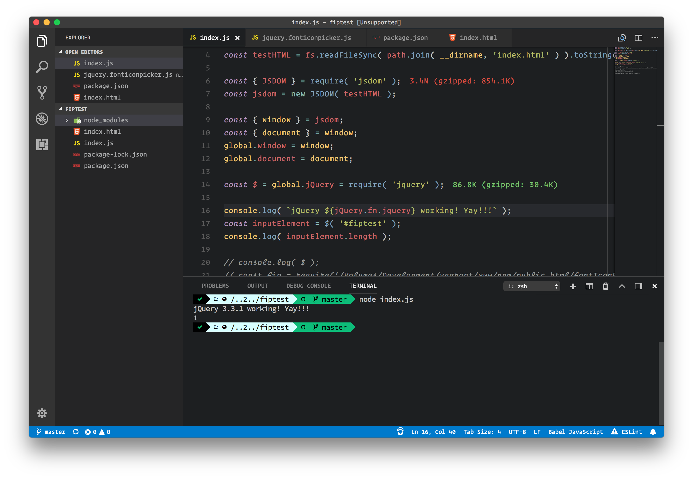

Recently I've been learning new things from [WesBos Courses](http://wesbos.com/courses/).
After finishing up the ES6 course, I thought about giving it a try on some real
project. So I went ahead and rewrote the legacy code of [fontIconPicker](https://github.com/fontIconPicker/fontIconPicker).

After rewriting it to ES6 modules, I went a step ahead to test things. For
obvious reasons, I choose [jest](https://facebook.github.io/jest/) for implementing
unit and integration tests.

But soon enough, I ran into problem while initiating jQuery from node environment.
Now you can argue that jest with [jsdom](https://github.com/jsdom/jsdom) loads
jQuery fine, but that wasn't how I was trying things first.

To learn node, more in-depth, this is what I tried

```js
const testHTML = `
<!DOCTYPE html>
<html>
<head>
</head>
<body>
	<input type="text" id="fiptest">
</body>
</html>
`;

const { JSDOM } = require( 'jsdom' );
const jsdom = new JSDOM( testHTML );

const $ = global.jQuery = require( 'jquery' );

const inputElement = $( '#fiptest' );
console.log( inputElement.length );
```

Running it in node, straight away bailed out with the error.

```bash
node index.js

Error: jQuery requires a window with a document
    at module.exports
```

So the solution lied in the error message itself. I had to create a global `window`
and `document` before `jquery` is included.

For this we will use `jsdom`.

## Using jQuery with JSDOM v11

There are APIs to "jQueryfy" jsdom prior version 10. But starting v10, it is no
longer available, rather jsdom now provides much more flexible APIs. This is the
solution I came up with.

```js
const testHTML = `
<!DOCTYPE html>
<html>
<head>
</head>
<body>
	<input type="text" id="fiptest">
</body>
</html>
`;
const { JSDOM } = require( 'jsdom' );
const jsdom = new JSDOM( testHTML );

// Set window and document from jsdom
const { window } = jsdom;
const { document } = window;
// Also set global window and document before requiring jQuery
global.window = window;
global.document = document;

const $ = global.jQuery = require( 'jquery' );

console.log( `jQuery ${jQuery.fn.jquery} working! Yay!!!` );
const inputElement = $( '#fiptest' );
console.log( inputElement.length );
```



Now it ran correctly.
